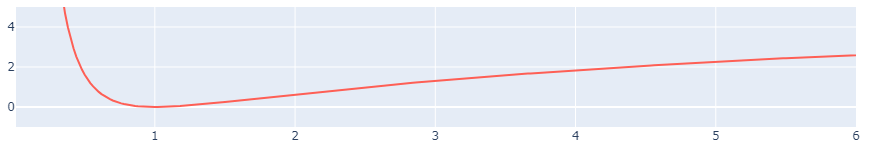
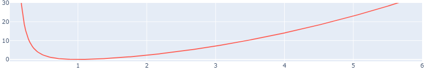

# Self-Arranging-Networks (using pytorch)

## Summary

Given a graph, i.e. a set of nodes and a set of ordered pairs of nodes, how can one give each node a 2-D position such that they are easily plotted as a graph? The proposed solution uses the PyTorch library to create a gradient decent based optimizers that finds a minimum loss configuration of the node positions. The solution uses two losses, one between each node and each other node (general loss), and one between each node and all the adjacent nodes (connected loss). The general and connected loss are given as:

$$ 
\begin{matrix}
L_g(n_0,n_1) =& \frac{N}{r^2}+\ln{ \frac{r^2}{N}}-1 \\
&\\
L_c(n_0,n_1) =& \frac{1}{r^2}+r^2-2 \\
\end{matrix}
$$

where $n_0$ and $n_1$ are the two nodes the loss is calculated between, $r$ is the euclidean distance between the nodes, and $N$ is the number of nodes in the graph. The final loss is then taken to be the mean over all node combinations. The node positions are updated via backpropogation from the final loss using the Adam optimizer. An example of the process can be seen in the GIF above.

## Background
Gradient decent optimization aims at finding points in a configurations space that yields the minimum loss. The task is then to simply create a loss landscape over the configuration space where a small loss corresponds to a "*good*" configuration. More formally we can see it as, given a configuration space, e.g. $C=\big ( \mathbb{R}^2\big)^N$, create a function 
$L: C \rightarrow \mathbb{R}$, where $L(x) < L(y) \Leftrightarrow x$ is "*better*" than $y$; $x,y \in C$. 

Given this loss landscape, gradient decent works by initiating a ppoint in the configuration space at random and then finding the gradient for that point. The negated gradient is a vector in the configuration space with a direction of the greatest downwards slope. The optimizer then "*takes a step*" in that direction which means that the configuration point is updated. This process continues untill a stop criterion is reached. Usually after a fixed number of steps, the gradient is demmed too small, or untill the loss doesn't change from update to update. If everything has gone well, we now have a point with a small loss that corresponds to a good configuration.

## Pipeline
The main aim of this project is to construct a loss function $L$ that takes in a x and y positions of a graph, and the connections of the graph and outputs a corresponding loss. Furthermore, the function needs to be loosly differentiable. 
The first step is to realize that we are not that intressted in the exact positions of the nodes, but rather their relative position. Hence, calculating the distance between each node might be a good idea. If $\bar{x}$ and $\bar{y}$ contains the x and y positions of the nodes respectivly, the matrix $R$, containing the distances between the nodes, can be found as $\Delta X^2+\Delta Y^2 = R^2$ where $\Delta X =\bar{x}-\bar{x}^T$ (analogously for $\Delta Y$). The subraction with the transponant should be read as each element in the left vector is subtracted by each element in the right one forming a matrix. The structure is similar to a matrix multiplication, but where the operation is subtraction. 
After the distance matrix $R$ is calculated we will split the path in two, one for calculating the loss in general between nodes (we don't want them to far apart or two close), and one just between the connected nodes (these should maybe tend to be even closer). After the split we need to remove the edges which are not to be counted. For the general branch, this means the diagonal elements as we do not care about the distance from a node to itself ... 
In the connected branch this means that we remove all the edges which are not an actual edge in the original graph. In practice, "*removal*" means an elementwise multiplication with a 0,1 matrix. Each elemtent in the product is the passed through the loss function to give two matrices containing the general and connected loss. The last step is then to simply sum up all elements in both matrices (or mean if we want to keep the numebers small) to get a final scalar loss. 
This whole pipeline can be seen as the function we wanted to create where the input is the current position of the nodes, and the output is a single loss value. A condenced version of the pipeline can be seen in the equation below.

$$
\left .
\begin{matrix}
\bar{x} \rightarrow \bar{x}-\bar{x}^T=\Delta X \\
\bar{y} \rightarrow \bar{y}-\bar{y}^T=\Delta Y\\
\end{matrix}
\right \rbrace
\rightarrow
\Delta X^2+\Delta Y^2 = R^2
\rightarrow
\left \lbrace
\begin{matrix}
L_g(R^2 \times M_g)=L_g \\
L_c(R^2 \times M_c)=L_c\\
\end{matrix}
\right \rbrace
\rightarrow
L_g+L_c = L
$$

## Loss Functions
The next step is to define the two loss functions $L_g$ and $L_c$. In general we want functions that are big for small values, then reaches a minimum at some specified point (let us say $1$ for simplicity), and then rise again for larger values. We also would like to punish nodes that are far apart and connected more then two nodes that are far appart and not connected. This means that the $L_c$ should grow faster than $L_g$ for larger values. 
Two examples of this kind of function is $f_1(r^2)=1/r^2 + r^2-2$ which punishes nodes that are further away more, and $f_2(r^2)=1/r^2 + \log(r^2)-1$ which punished the same nodes less. Both of the functions have the added benifits of having there minimum value at zero which happens for $r=1$. The former makes multiple of these losses easier to combine, and the later makes it easy to change the extreme point as setting $f(\frac{r^2}{a^2})$ will cause the function to reach its minimum at $r=a$. 
In the general loss case we would prefere something similar to $f_2$ as we don't want to increase the rate of the loss as the nodes get furthere apart. A node should not be too affected by a change of a point far away from it unless they are connected. How far can we expect the nodes to be from eachother? i.e. what should we set $a$ to?
If we have $N$ points that are distributed somewhat uniformly on a 2-d plane, then we can expect the radius to scale proportional to $\sqrt{N}$. This is also true for the general distances between points inside the area,  and hence $a=\sqrt{N}$.
For the connected loss, the $f_1$ seem more appropriate as the loss increases with the square of the distance for big distances (This is the common L2 loss). The minimum should be kept at 1 as we woudl like all of the connected nodes to stay close, and that that distance should not change with bigger $N$. 

    

    

## Further work (aka TODO)
* Investigate how sensitive the algoritm is to the change of loss function?
  * Can the general and connected loss be the same?
  * Using linear instead of swuare loss for large values in the connected loss.
  * Change the minimum point (i.e. move $a$).
* Investigate size of netowrk ($N$) and percentage of connectivness.
* Investigate and write about the loss during the optimization process.

## Structure of Repository
The repository contain three main folders `src`, `notebooks`, and `data`. The `src` folder contains the python files with the functions used in the notebooks. Here the main file is `arrangin_network.py` which contain the function `arrange_network` which implements the algoritm. The `notebooks` folder contains jupyter notebooks that investigates the algoritms and functions given int `src`. If repo is cloned, this is a good place to start. Finally `data` contains the data used in the notebook examples. 

